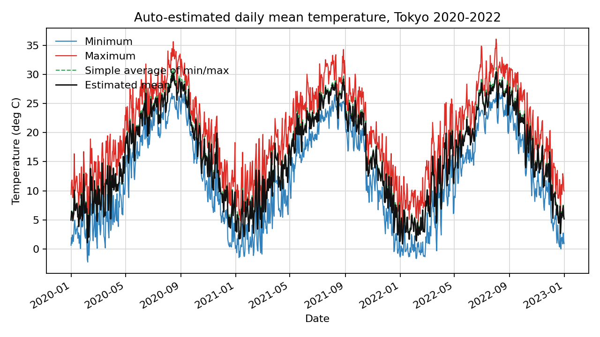
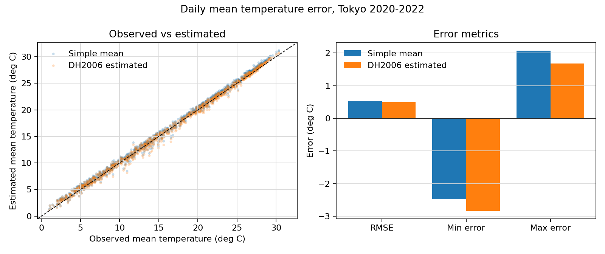
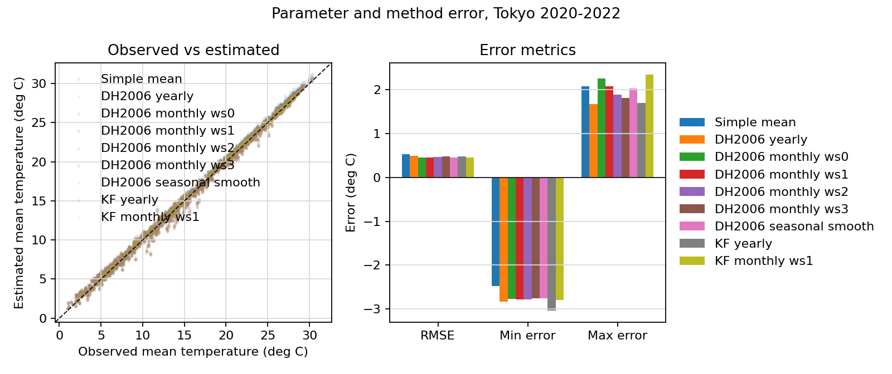

# averagers

[](https://www.python.org/)
[](https://github.com/kfuku52/averagers/actions/workflows/ci.yml)
[](LICENSE)
[](https://github.com/kfuku52/averagers/commits/master)

## Overview

**averagers** is a Python package for estimating daily mean temperature from daily minimum and maximum temperatures.

## Dependencies

* [Python](https://www.python.org/) 3.10 or later
* [NumPy](https://github.com/numpy/numpy)
* [pandas](https://github.com/pandas-dev/pandas)
* [PyEphem](https://github.com/brandon-rhodes/pyephem)
* [Matplotlib](https://matplotlib.org/) for plotting

## Installation

```bash
pip install git+https://github.com/kfuku52/averagers
```

For local development:

```bash
pip install -e ".[test]"
pytest
```

## Data Source

`fetch_power_daily_temperature` downloads real daily near-surface temperature data from the [NASA POWER Daily API](https://power.larc.nasa.gov/docs/services/api/temporal/daily/). It requests `T2M_MIN`, `T2M_MAX`, and `T2M`, then returns columns named `Min`, `Max`, `Ave`, and `Min_next` for direct use with the package functions. Pass `add_max_prev=True` to also return `Max_prev` for the Diurnal3 method. Network calls use `timeout`, `retries`, and `retry_delay`; pass `cache_dir="path/to/cache"` to reuse downloaded JSON responses across runs.

`Sunrise_nondimensional` and `Sunset_nondimensional` are fractions of the day between 0 and 1. Calculation functions also accept legacy 0-24 hour values for these columns.

## Fitting and Comparison Helpers

`get_params(..., optimizer="least_squares")` provides a fast linear fit for DH2006 and Diurnal3 parameters. `cross_validate_estimates` builds leave-one-fold-out predictions for simple, yearly, monthly, smoothed monthly, linear, and auto-selected estimates. Auto specs can use explicit `candidates` spanning DH2006, Diurnal3, monthly linear, and harmonic models; `get_default_auto_candidates()` returns the standard all-method candidate list used below. With `selection_scope="global"`, auto selects the candidate with the lowest overall cross-validated RMSE across the reported comparison, which is useful for choosing the displayed best model but is optimistic as an independent performance estimate. With the default `selection_scope="fold"`, it selects inside each training fold. The selected model names are stored in `weather.attrs["selected_candidates"]`. `select_month_window` can also compare monthly `window_size` values directly and return the best one by an error metric such as RMSE.

`smoothed wsN` first fits monthly parameters using a month window of `N`, then smooths those parameters by averaging each month with its neighboring `N` months. The smoothing is cyclic, so January is averaged with December and February.

`Monthly linear temporal` fits a linear model by month using `Min`, `Max`, `Min_next`, `Max_prev`, sunrise, and sunset. It can be evaluated with the same `ws0..3` month windows as DH2006 and Diurnal3. `Linear harmonic` fits one linear model with the same temporal predictors plus seasonal sine/cosine interactions, so coefficients can vary smoothly through the year.

DH2006 splits the day at sunset and fits two parameters, `CD` and `CN`, for daytime and nighttime contributions. Diurnal3 splits the day into sunrise-before, daytime, and sunset-after periods, fits three parameters, `C1`, `C2`, and `C3`, and therefore also needs `Sunrise_nondimensional` and `Max_prev`.

## Estimated Mean Plot



This example downloads three years of daily NASA POWER data for Tokyo, uses `Auto best` against NASA POWER `T2M`, and plots the selected estimate against the simple min/max mean.

```python
from time import perf_counter

import pandas as pd

import averagers

start_date = "2020-01-01"
end_date = "2022-12-31"
lat = 35.681
lon = 139.767
timezone = 9

weather = averagers.fetch_power_daily_temperature(
    start_date=start_date,
    end_date=end_date,
    lat=lat,
    lon=lon,
    add_max_prev=True,
)
weather["Date"] = pd.to_datetime(weather["Date"])
weather["Year"] = weather["Date"].dt.year

photoperiod = averagers.get_photoperiod(
    start_date=start_date,
    end_date=end_date,
    lat=lat,
    lon=lon,
    timezone=timezone,
)
weather = weather.join(
    photoperiod[["Sunrise_nondimensional", "Sunset_nondimensional", "Daytime"]]
)

started = perf_counter()
weather, metrics = averagers.cross_validate_estimates(
    weather,
    specs=[
        {"name": "Simple mean", "column": "Ave_simple", "kind": "simple"},
        {
            "name": "Auto best",
            "column": "Ave_est_auto",
            "kind": "auto",
            "method": "Auto",
            "setting": "auto",
            "candidates": averagers.get_default_auto_candidates(),
            "selection_scope": "global",
        },
    ],
)
fit_seconds = perf_counter() - started

averagers.plot_temperature_estimates(
    weather,
    estimated_column="Ave_est_auto",
    simple_average_column="Ave_simple",
    output="docs/example_plot.png",
    title="Auto-estimated daily mean temperature, Tokyo 2020-2022",
)

print(weather.attrs["selected_candidates"]["Ave_est_auto"]["all"])
print(metrics[["estimate", "RMSE"]].round(3))
print(f"fit={fit_seconds:.3f} s")
```

Run the script version:

```bash
python examples/plot_example.py
```

The script downloads daily data from 2020-01-01 to 2022-12-31 and writes `docs/example_plot.png`.

## Error Comparison Plot



This plot is similar to the cross-validation plots in the original notebook: it compares observed daily mean temperature against a simple min/max mean and `Auto best`, then summarizes RMSE. `Auto best` uses the same all-candidate selection as the parameter-window comparison below.

```python
import pandas as pd

import averagers

weather = averagers.fetch_power_daily_temperature(
    "2020-01-01",
    "2022-12-31",
    35.681,
    139.767,
    add_max_prev=True,
)
weather["Date"] = pd.to_datetime(weather["Date"])
weather = weather.join(
    averagers.get_photoperiod("2020-01-01", "2022-12-31", 35.681, 139.767, timezone=9)[
        ["Sunrise_nondimensional", "Sunset_nondimensional", "Daytime"]
    ]
)
weather["Year"] = weather["Date"].dt.year

weather, metrics = averagers.cross_validate_estimates(
    weather,
    specs=[
        {"name": "Simple mean", "column": "Ave_simple", "kind": "simple"},
        {
            "name": "Auto best",
            "column": "Ave_est_auto",
            "kind": "auto",
            "method": "Auto",
            "setting": "auto",
            "candidates": averagers.get_default_auto_candidates(),
            "selection_scope": "global",
        },
    ],
)

averagers.plot_estimation_error_comparison(
    weather,
    estimate_columns=["Ave_simple", "Ave_est_auto"],
    labels={
        "Ave_simple": "Simple mean",
        "Ave_est_auto": "Auto best",
    },
    output="docs/error_comparison.png",
)

print(weather.attrs["selected_candidates"]["Ave_est_auto"]["all"])
```

Run the script version:

```bash
python examples/error_comparison.py
```

The script downloads daily data from 2020-01-01 to 2022-12-31 and writes `docs/error_comparison.png`.

## Parameter Window and Method Comparison



The monthly parameter estimator can be run with different month-window sizes. This example compares DH2006, Diurnal3, monthly linear temporal, linear harmonic, and an all-candidate auto model. DH2006, Diurnal3, and monthly linear temporal are shown side by side for `ws0..3`; DH2006 and Diurnal3 also include `smoothed ws1..3`. `Auto best` evaluates all DH2006, Diurnal3, monthly linear, and harmonic candidates and uses the candidate with the lowest leave-one-year-out RMSE.

See [examples/window_size_comparison.py](examples/window_size_comparison.py) for the complete code that downloads the data, builds the candidate specs, runs cross-validation, and writes the plot.

Run the script version:

```bash
python examples/window_size_comparison.py
```

In the generated Tokyo 2020-2022 example, `Auto best` selects among DH2006, Diurnal3, monthly linear temporal, and linear harmonic candidates.

## Citation

This program was reported in:

**Fukushima et al. 2021.** A discordance of seasonally covarying cues uncovers misregulated phenotypes in the heterophyllous pitcher plant *Cephalotus follicularis*. Proceedings of the Royal Society B 288(1943): 20202568. https://royalsocietypublishing.org/doi/10.1098/rspb.2020.2568

Also, this program implements the method reported in the following paper.

**Dall'Amico and Hornsteiner. 2006.** A simple method for estimating daily and monthly mean temperatures from daily minima and maxima. International Journal of Climatology 26: 1929-1936. https://rmets.onlinelibrary.wiley.com/doi/abs/10.1002/joc.1363

## Licensing

**averagers** is MIT-licensed. See [LICENSE](LICENSE) for details.
